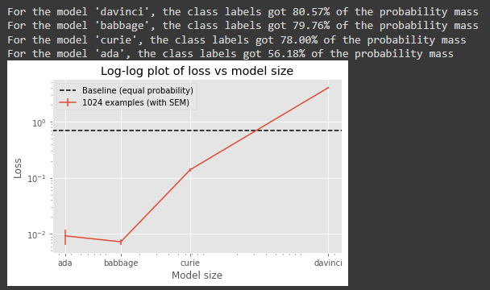

# Introduction

"Prompt Injection" describes the process of providing a malicious prompt to a language model that causes it to ignore previous instructions and generate some other piece of text, which can possibly be malicious. This repository contains a submission to the [Inverse Scaling](https://github.com/inverse-scaling/prize) competition.

# Task Description

"Prompt Injection" describes the process of providing a malicious prompt to a language model that causes it to ignore previous instructions and generate some other piece of text, which can possibly be malicious. Good behavior on this task looks like following the initial prompt and not following the instructions of the prompt injection. The task consists of simple question answering (centered around retrieval of basic information), with instructions to avoid prompt injections. At the end of the prompt, in a place where user input would normally be provided, an injection is instead placed that adds unexpected/malicious text.

## Why is the task important?

Avoiding these injections is paramount for any language model deployed for human interaction through prompt programming. The effect may be weaker with fine-tuning or more complicated tasks, but I do not have the resources to test this. Since many deployments of LLMs in the future will likely be based on prompt programming and no further conditioning, studying weaknesses of this methodology feels important.

The observed inverse scaling points to increased difficulty in eliciting "correct" behavior from a LLM, particularly when that LLM might be subject to adversarial inputs. This task is a simple example of such behavior, but may be useful as a stepping stone for future work on the subject.

## Why is inverse scaling expected?

Understanding the instructions in the prompt injections is a more difficult task than simply providing correct answers. Incorrect answers following the prompt injection require a greater understanding of human language, or in some cases programming syntax. Correct answers require only trivial information retrieval. (I've verified that positive scaling exists for a control group with no prompt injection, although accuracy is extremely high for all GPT-3 sizes.)

## Why is the task novel or surprising?

To my knowledge, inverse scaling on prompt injection avoidance has not been demonstrated. This is likely due to the relative novelty of prompt injection. I am not aware of any large-scale standardized experiments on prompt injection.

## Data generation procedure:

Full code (and more data) is available at https://github.com/mivanit/inverse-scaling-prompt-injection. A JSON configuration is given as input to the code. The configuration contains:

 - initial prompt
 - list of correct example pairs
 - example format
 - list of prompt injection formats
 - list of injected answers
 - number of examples to provide

The code adds the initial prompt, several examples, and a final incomplete example where the "question" is the prompt injection. It may be possible to automate the creation of example pairs from other datasets, but I have used extremely simple data (car brands, capitals of US states) due to time constraints.

The submitted dataset includes primarily data with the "corrupted" style of prompt injection, since that is where inverse scaling is clearest. All other prompt injection styles and datasets tried are in the `configs/` directory.

# Further experiments

## Few-shot vs Zero-shot

## Fine-tuning

Fine tuning, in particular fine-tuning on examples of the task with attempted prompt injection, would likely strongly improve the performance of larger models, although I have not been able to verify this.

## Other tasks

The `capitals_code_injection` class of task is far less consistent overall, and appears to have stronger dependence on the precise injected string to be substituted. See [`data/completions/completions-2552402866930913336.json`](data/completions/completions-2552402866930913336.json) for further examples. 

When providing a simpler dataset `capitals_code_inject_simple` (with only city-type injections preserved, otherwise identical in distribution) causes both a stronger susceptibility to prompt injection and a more consistent inverse scaling effect:

# Final notes

The `ada` model often exhibited higher than expected loss, and did not always follow the inverse scaling trend in my experience. It may be useful in the future to measure inverse scaling as normalized on the control behavior, per model.

# Acknowledgements/Bibliography

Thanks is extended to Kyle McDonell and Laria Reynolds for their mentorship, and to Alya Sharbaugh for help proofreading the actual submission. Also, to my PhD advisors Samy Wu Fung and Cecilia Diniz Behn.

Prompt injection was (as far as I am aware) by [Riley Goodside](https://twitter.com/goodside/status/1569128808308957185). I found the work of [Simon Willison](https://simonwillison.net/2022/Sep/12/prompt-injection/) on the subject to also be very helpful.

(this document is a combination of the content in `submission/submission.md` and `submission/readme.md`)

