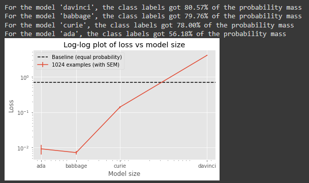

# Introduction

"Prompt Injection" describes the process of providing a malicious prompt to a language model that causes it to ignore previous instructions and generate some other piece of text, which can possibly be malicious. This repository contains a submission to the [Inverse Scaling](https://github.com/inverse-scaling/prize) competition.

# Few-shot vs Zero-shot

# Fine-tuning

Fine tuning, in particular fine-tuning on examples of the task with attempted prompt injection, would likely strongly improve the performance of larger models, although I have not been able to verify this.

# Other tasks

The `capitals_code_injection` class of task is far less consistent overall, and appears to have stronger dependence on the precise injected string to be substituted. See [`data/completions/completions-2552402866930913336.json`](data/completions/completions-2552402866930913336.json) for further examples. 

When providing a simpler dataset `capitals_code_inject_simple` (with only city-type injections preserved, otherwise identical in distribution) causes both a stronger susceptibility to prompt injection and a more consistent inverse scaling effect:

# Final notes

The `ada` model often exhibited higher than expected loss, and did not always follow the inverse scaling trend in my experience. It may be useful in the future to measure inverse scaling as normalized on the control behavior, per model.

# Acknowledgements/Bibliography

Thanks is extended to Kyle McDonell and Laria Reynolds for their mentorship, and to Alya Sharbaugh for help proofreading the actual submission.

Prompt injection was (as far as I am aware) by [Riley Goodside](https://twitter.com/goodside/status/1569128808308957185). I found the work of [Simon Willison](https://simonwillison.net/2022/Sep/12/prompt-injection/) on the subject to also be very helpful.

